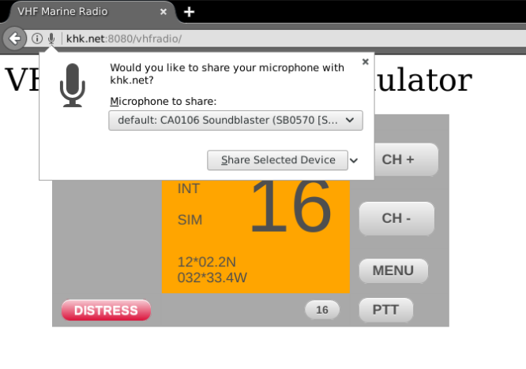
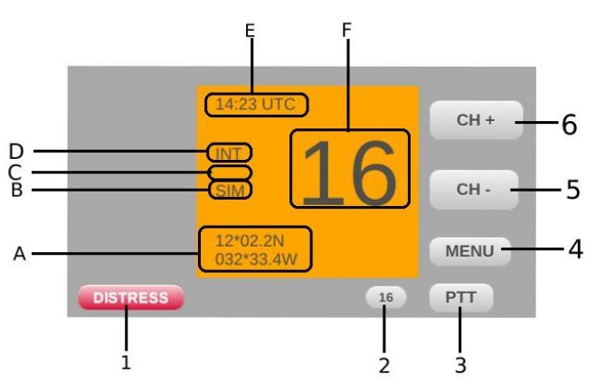
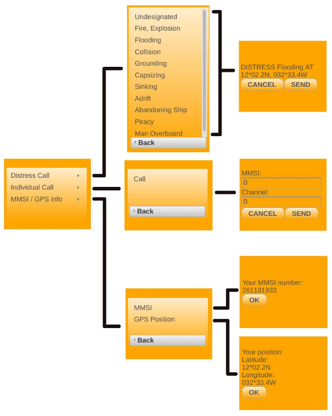
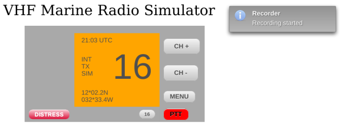
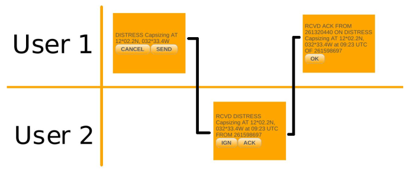
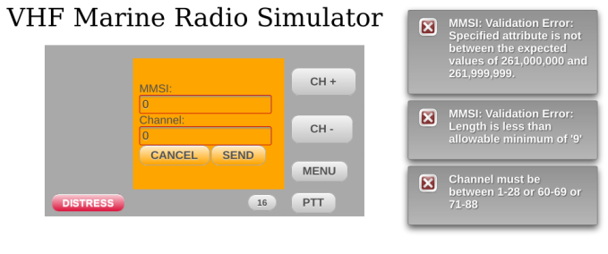
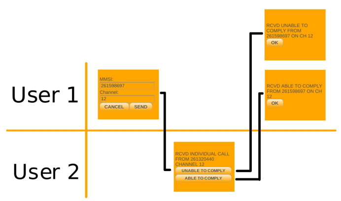

# VHF Marine Radio simulator

---

<p>
<a href="#Aim of the project">Aim of the project</a></br>
<a href="#VHF radio quick summary">VHF radio quick summary</a></br>
<a href="#Alternatives">Alternatives</a></br>
<a href="#Use cases">Use cases</a></br>
<a href="#Requirements">Requirements</a></br>
<a href="#Deployment">Deployment</a></br>
<a href="#Contribution">Contribution</a></br>
<a href="#License">License</a></br>
</p>

---

## Aim of the project

---
The goal of the project was to develop an easy-to-use tool that simulates the functionality of the real VHF
marine radio. By enabling the possibility of performing the basic procedures while interacting
with others, the user would have the possibility to practice and learn the operation of the radio
to get familiarized with it.

According to the preliminary assumptions, the simulator was supposed to allow voice and
Digital Selective Calling (DSC) communication over the network between users to provide real
interactions.

## VHF radio quick summary

---
Safety at sea is a very important matter and ability to communicate correctly is a part
of that especially in dangerous situations. The effective handling of the radio requires familiarity, proper knowledge and training. To gather and possess the proper knowledge how to operate the VHF marine radio, for its use
and for examination, it is necessary to practice with such a radio. This simulator enables to practice the basics.

## Alternatives

---

### Telenor “VHF Simulator”

http://kystradio.no/privat/sertifikat/test-deg-selv/english-vhf-simulator/

### EGMDSS “VHF Radio simulator”

https://www.egmdss.com/gmdss-courses/mod/resource/view.php?id=93

### “VHF / DSC Radio Simulator”

https://www.boatus.org/dsc/player.html

## Use cases

---

Enable microphone:



### Manual



```aidl
1 - DISTRESS BUTTON [DISTRESS]
Push to open and send distress call

2 - CHANNEL 16 BUTTON [16]
Push to select distress channel 16

3 – PUSH-TO-TALK BUTTON [PTT]
Hold down to transmit voice call 

4 – MENU BUTTON [MENU]
Push to enter or exit the menu screen

5 – CHANNEL DOWN BUTTON [CH -]
Push to select one channel up 

6 – CHANNEL UP BUTTON [CH +]
Push to select one channel down

A – POSITION INDICATOR
Shows the geographical position which is set 
by default and can not be changed 

B – CHANNEL TYPE INDICATOR
Shows channel type SIM for simplex or DUP for duplex

C – BUSY / TRANSMIT INDICATOR
Shows BUSY when the radio is receiving voice call on 
current channel, TX if the radiois transmitting or 
nothing when nothing from
the above happens 

D – CHANNEL GROUP INDICATOR
Shows channel group which is INT for
international by default and can not be
changed

E – TIME INDICATOR
Shows current time, not local but
UTC which is sometimes referred also as
Greenwich Mean Time (GMT) F – CHANNEL NUMBER
Shows the number of the selected operating
channel

F – CHANNEL NUMBER
Shows the number of the selected operating
channel
```

### Menu structure



### Voice transmission

When the user starts the voice transmission the TX icon is shown on the display and the
PTT button’s background color changes to red to indicate that it is pressed.



### Distress call

Distress call sequence:



### Individual call

To send the individual call, its form must be filled with parameters that concern the recipient
MMSI number and proposed channel and since these two numbers have constrains before the
message is sent, they are validated.



Individual call sequence



## Requirements
* JDK 1.8
* Apache Maven 3.0
* Web application server ( Glassfish or Wildfly )
* Web browser ( Chrome, Firefox )
* Microphone
* Speakers or headphones

## Deployment

Build:
```bash
PROJECT_HOME/mvn clean install
```
Start Glassfish:
```bash
GLASSFISH_HOME/bin/asadmin start-domain
```

Deploy
```bash
GLASSFISH_HOME/bin/asadmin deploy PROJECT_HOME/target/VHFRadio-1.0-SNAPSHOT
```
Server logs:
```bash
tail -f GLASSFISH_HOME/glassfish/domains/domain1/logs/server.log
```

Verify deployment:
```bash
GLASSFISH_HOME/bin/asadmin list-applications
```
Visit

<i> http://localhost:8080/vhfradio/ </i>

## Contribution

Feel free to contribute to the project.

## License

The VHF Marine Radio simulator is intended only for uncommercial use